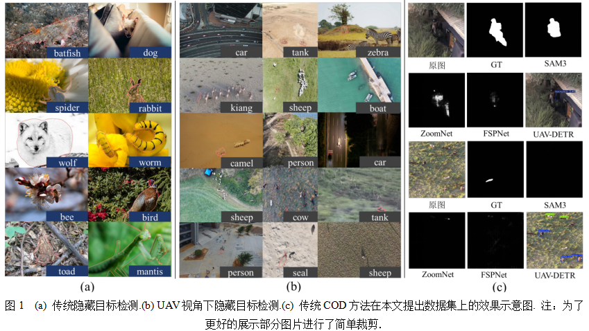
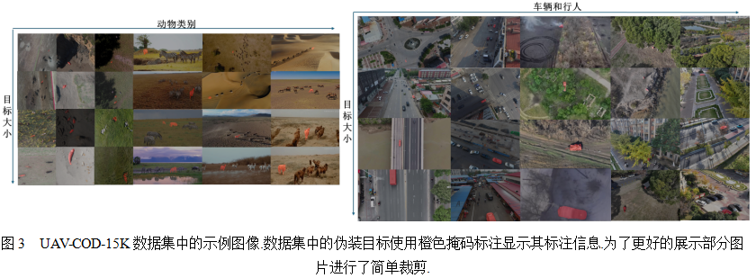
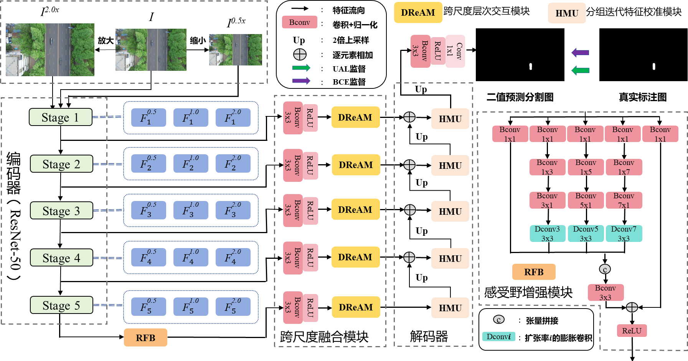
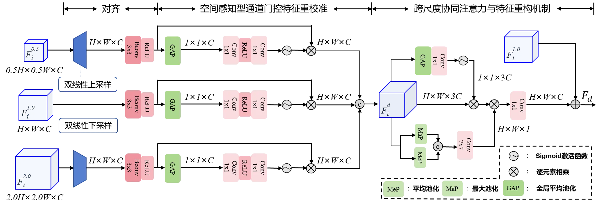
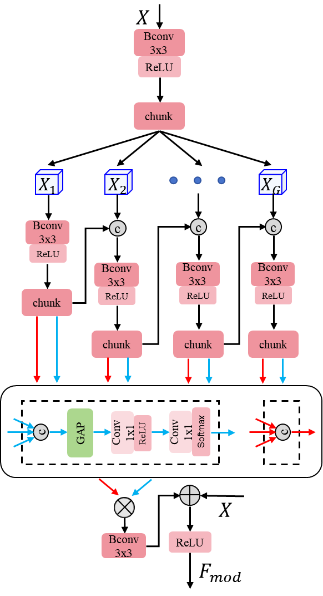
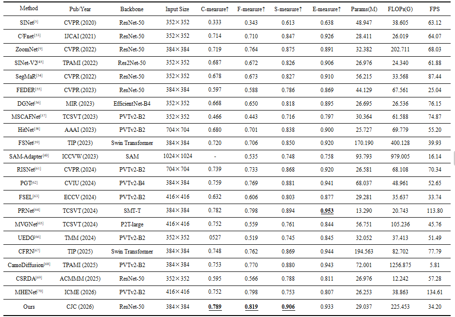
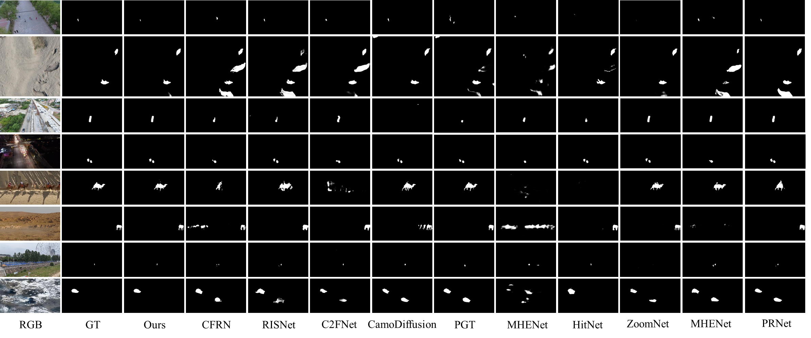

# UAV-COD-Net

Code for UAV-COD-Net (无人机视角下隐藏目标检测)。

本仓库提供 UAV-COD-Net 的 PyTorch 实现代码。

## 环境要求

- Python 3.8
- PyTorch 1.8.1
- CUDA：请安装与本机 PyTorch 版本兼容的 CUDA 环境

建议使用 Conda 创建独立环境：

```bash
conda create -n uavcod python=3.8
conda activate uavcod
pip install -r requirements.txt
```

## 数据集准备

数据集下载链接：https://pan.quark.cn/s/254e8421d707?pwd=mfRi

下载并解压数据集后，请保证训练集与测试集分别包含以下目录：

```text
train_with_val/
├── images/
└── masks/

test/
├── images/
└── masks/
```

随后编辑 [`configs/_base_/dataset/dataset_configs.json`](configs/_base_/dataset/dataset_configs.json)，将 `root` 修改为本机数据集路径：

```json
{
  "msi_cod_tr": {
    "root": "/path/to/train_with_val/"
  },
  "msi_cod_te": {
    "root": "/path/to/test/"
  }
}
```

请保留该文件中 `image` 和 `mask` 的其余配置；默认图片后缀为 `.jpg`，掩码后缀为 `.png`。

## 训练

在项目根目录执行：

```bash
python main.py \
  --config configs/uav_hidenet/cod_uav_hidenet.py \
  --datasets-info configs/_base_/dataset/dataset_configs.json
```

训练结果、日志、预测图和模型权重默认保存至 `output/` 目录。

## 测试

在项目根目录执行：

```bash
python main.py \
  --config configs/uav_hidenet/cod_uav_hidenet.py \
  --datasets-info configs/_base_/dataset/dataset_configs.json \
  --load-from /path/to/model.pth \
  --test-only
```

### 预训练权重与结果

预训练模型权重和完整实验结果已发布在:
| Weights                                                                                                                           | Results                                                                                                       |
| --------------------------------------------------------------------------------------------------------------------------------- | ------------------------------------------------------------------------------------------------------------- |
| [GitHub Release Link](https://github.com/Liyuhan1666666/UAV-COD-Net/releases/download/v0.0.1/checkpoint_final.zip)        | [GitHub Release Link](https://github.com/Liyuhan1666666/UAV-COD-Net/releases/download/v0.0.1/Results.zip) |

## 论文细节

### UAV-COD-15K 数据集

<div align="center">
  
</div>

<div align="center">
  
</div>

### 方法

<div align="center">
  
</div>

<div align="center">
  
</div>

<div align="center">
  
</div>

### 实验

<div align="center">
  
</div>

<div align="center">
  
</div>

## 引用

如果本项目对您的研究有帮助，请引用对应论文：

```bibtex
@article{UAVCODNet,
  title   = {无人机视角下隐藏目标检测},
  author  = {鄢杰斌，蒋佳，李昱翰，祝文涛，侯敬文，姜文晖，方玉明},
  journal = {待补充},
  year    = {2026}
}
```
